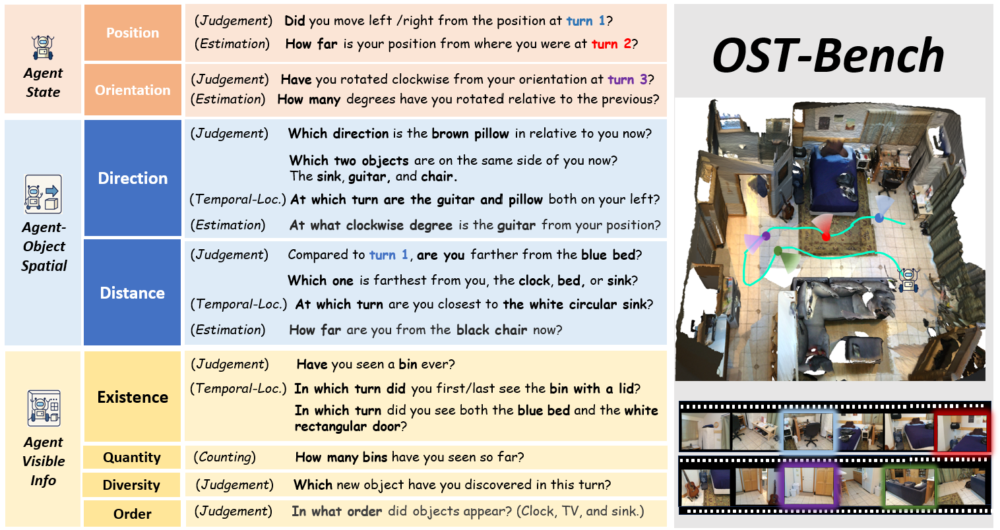

<div align="center">

# OST-Bench:  Evaluating the Capabilities of MLLMs in Online Spatio-temporal Scene Understanding
[**🌐 Homepage**](https://rbler1234.github.io/OSTBench.github.io/)  | [**📑 Paper**](https://arxiv.org/pdf/2507.07984) | [**🤗 dataset**](https://huggingface.co/datasets/rbler/OST-Bench_v1) | [**📖 arXiv**](https://arxiv.org/abs/2507.07984)
</div>


<!-- contents with emoji -->

## 📋 Contents

1. [News](#🔔-news)
2. [About](#🏠-about)
3. [Getting Started](#🚀-getting-started)
4. [Evaluation](#👓-evaluation)
5. [Leaderboard](#🏆-leaderboard)

## 🔔 News
🔥[2025-07]: OST-Bench has been supported in the VLMEvalKit repository.

🔥[2025-07]: We released our paper, benchmark, and evaluation codes.

## 🏠 About

<!--  -->

<div style="text-align: center;">
    
</div>

Recent advances in multimodal large language models (MLLMs) have shown remarkable capabilities
in integrating vision and language for complex reasoning. While most existing benchmarks evaluate models under offline settings with a fixed set of pre-recorded inputs, we introduce OST-Bench, a benchmark designed to evaluate Online Spatio-Temporal understanding from the perspective of an agent actively exploring a scene.  The “Online” aspect emphasizes the need to process and reason over incrementally acquired observations, while the “Spatio-Temporal” component requires integrating current visual inputs with historical memory to support dynamic spatial reasoning. OST-Bench better reflects the challenges of real-world embodied perception. Built on an efficient data collection pipeline, OST-Bench consists of 1.4k scenes and 10k question-answer pairs collected from ScanNet, Matterport3D, and ARKitScenes. We evaluate several leading MLLMs on OST-Bench and observe that they fall short on tasks requiring complex spatio-temporal reasoning. Under the online setting, their accuracy declines as the exploration horizon extends and the memory grows. Through further experimental analysis, we identify common error patterns across models and find that both complex clue-based spatial reasoning demands and long-term memory retrieval requirements significantly drop model performance along two separate axes, highlighting the core challenges that must be addressed to improve online embodied reasoning.

## 🚀 Getting Started

### Installation

1. Clone Github repo.

   ```shell
   git clone https://github.com/OpenRobotLab/OST-Bench.git
   cd OST-Bench
   ```

2. Install requirements.

   ```shell
   conda activate your_env_name
   pip install -r requirements.txt
   ```

   *Note:* If you want to evaluate open-source models, you need to set up their corresponding environments.

### Data Preparation

  Download the datas of OST-Bench from [kaggle](https://www.kaggle.com/datasets/jinglilin/ostbench/) / [huggingface](https://huggingface.co/datasets/rbler/OST-Bench) and unzip the image files and the json file, place them as followed:

  ```
  |-data/
  |-- OST_bench.json
  |-- images/
  |----<scan_id folder>
  ```

  For more detail about the json-format data, refer to [documention](https://huggingface.co/datasets/rbler/OST-Bench).

## 👓 Evaluation

### Multi-round Evaluation

#### Setup
  We provide inference code compatible with both closed-source models (e.g., GPT, Gemini, Claude series) and open-source models (e.g., InternVL2.5, QwenVL2.5, LLaVA-Video, LLaVA-OneVision) on our OST-Bench.

  For closed-source models, please fill in the appropriate API keys in `models/utils/openai_api.py` according to the model you plan to use. For open-source models, follow the Quickstart of [QwenVL](https://github.com/QwenLM/Qwen2.5-VL) / [InternVL](https://internvl.readthedocs.io/en/latest/internvl2.5/quick_start.html) / [LLaVA](https://github.com/LLaVA-VL/LLaVA-NeXT/tree/main) to set up the required environment and download the corresponding checkpoints.

#### Inference

1. To perform inference with closed-source models, run the following command:

    ```shell
    python proprietary_baseline.py --rank_num int --model_name str --save_root str
    ```

    Closed-source model inference supports multi-process execution, where `rank_num` specifies the number of processes, `model_name` indicates the model to use,
    `save_root` is the directory to save the inference results.

2.  To perform inference with open-source models, run the following command:

    ```shell
    python InternVL/LLaVA/QwenVL_baseline.py --rank_index int --rank_num int --model_path str --save_root str
    ```

    Open-source model inference also supports multi-process execution, where `rank_index` specifies the index of the current process and `model_path` is the path to the model and its weights.

3.  Our inference code groups the input data into multi-turn dialogues, where each scene corresponds to one dialogue session. These multi-turn dialogues are fed into the model to generate multi-round responses. The results will be saved in `output_dir` as multiple files named `<scan_id>.json`, each containing the model's responses for all turns in that scene, which can be used for inspection or evaluation. Welcome to implement your method under the `models/your_method.py`!

#### Evaluator

  Use our OST evaluator to get the results, the evaluator will return full results over all question types and the average results across three main categories (*Agent Visible Info*, *Agent Object Spatial*，*Agent State* ) and four question formats.

  ```bash
  cd evaluation
  python OST_evaluator.py --result_dir /path/to/save
  ```

### Interleaved Evaluation (VLMEvalkit)

Our OST-Bench has been integrated into VLMEvalKit. Follow the [QuickStart](https://github.com/open-compass/VLMEvalKit/blob/main/docs/en/Quickstart.md) to get started with VLMEvalKit and evaluate OST-Bench!

```
LMUDATA/
├──OST.tsv
├──images/
├────OST/
├──────<scan_id folder>
```

Place the images under `LMUDATA`.When using VLMEvalKit to evaluate OST-Bench, When evaluating the performance of models `llava/qwenvl/InternVL` series, set `max_new_tokens` to 4096 to ensure complete reproducibility of the results.  Additionally, when using the LLaVA_OneVision series of models, set `self.model.config.image_aspect_ratio` = 'pt'  (under `vlmeval/vlm/llava/llava.py`).

Run the following command to perform evaluation:

```shell
python run.py --model GPT4o --data OST
```

*Note*: As most VLMEvalKit models do not support multi-turn inference, we provide an interleaved version of OST-Bench, where each sample merges the system prompt, history, and current question into a single turn. Evaluation results may slightly differ from true multi-round settings.

## 🏆 Leaderboard

## Multi-round Version

|                            | Overall | A-State | A-info | AO-Spatial | Judge  | Temp-Loc | Cnt.   | Esti.  |
|----------------------------|---------|---------|--------|------------|--------|----------|--------|--------|
| Proprietary                |         |         |        |            |        |          |        |        |
|      Claude-3.5-Sonnet     | 47.77   | 45.55   | 65.56  | 32.85      | 57.37  | 46.73    | 57.90  | 26.85  |
|      Gemimi-2.0-Flash      | 49.54   | 45.05   | 70.82  | 33.80      | 61.11  | 45.83    | 59.40  | 28.10  |
| Gemimi-2.0-Flash(Thinking) | 54.25   | 47.05   | 72.30  | 42.75      | 63.61  | 61.10    | 61.90  | 28.93  |
|           GPT-4o           | 48.72   | 38.83   | 72.76  | 33.52      | 59.83  | 48.57    | 59.80  | 23.98  |
|           GPT-4.1          | 53.40   | 47.23   | 76.46  | 37.65      | 66.44  | 51.67    | 60.60  | 29.10  |
| Open-Source                |         |         |        |            |        |          |        |        |
|       InternVL-2.5-8B      | 38.98   | 41.88   | 52.78  | 29.18      | 52.34  | 22.50    | 55.40  | 29.30  |
|      InternVL-2.5-38B      | 50.78   | 45.38   | 73.88  | 33.95      | 61.39  | 45.93    | 61.10  | 31.50  |
|      InternVL-2.5-78B      | 51.08   | 46.45   | 74.02  | 32.93      | 61.51  | 47.07    | 65.90  | 28.95  |
|        QwenVL-2.5-7B       | 41.16   | 40.43   | 52.56  | 31.53      | 50.13  | 36.60    | 62.10  | 22.73  |
|       QwenVL-2.5-32B       | 46.86   | 43.75   | 64.90  | 32.18      | 55.44  | 42.93    | 59.20  | 29.13  |
|       QwenVL-2.5-72B       | 45.62   | 43.48   | 64.46  | 28.87      | 55.91  | 41.63    | 61.50  | 22.90  |
|       LLaVA-Video-7B       | 39.28   | 33.50   | 58.32  | 28.80      | 52.77  | 33.80    | 63.10  | 16.13  |
|       LLaVA-Video-72B      | 43.22   | 39.95   | 60.48  | 35.07      | 56.01  | 37.57    | 51.00  | 29.20  |
|     LLaVA-Onevision-7B     | 40.36   | 31.08   | 55.24  | 33.63      | 51.24  | 32.47    | 66.90  | 19.83  |
|     LLaVA-Onevision-72B    | 43.44   | 38.88   | 61.60  | 36.23      | 58.83  | 39.23    | 45.80  | 26.40  |
| Baseline                   |         |         |        |            |        |          |        |        |
|         Human-Level        | 84.05   | 74.83   | 93.40  | 81.02      | 92.99  | 94.17    | 91.30  | 56.93  |
|        Chance-Level        | 35.73   | 44.28   | 32.42  | 35.72      | 40.00  | 31.17    | 25.00  | 38.75  |

## VLMEvalkit Interleaved Version

|                     | Overall | A-State | A-info | AO-Spatial | Judge | Temp-Loc | Cnt.  | Esti. |
|---------------------|---------|---------|--------|------------|-------|----------|-------|-------|
|        GPT-4o       | 51.19   | 41.76   | 71.52  | 37.16      | 62.23 | 48.51    | 63.16 | 29.26 |
|       GPT-4.1       | 50.96   | 43.61   | 71.24  | 35.58      | 64.43 | 47.75    | 62.83 | 25.72 |
|   InternVL-2.5-8B   | 35.32   | 31.94   | 44.69  | 28.22      | 48.32 | 35.71    | 43.95 | 12.75 |
|   InternVL-2.5-38B  | 48.54   | 43.11   | 64.66  | 36.05      | 58.97 | 42.88    | 62.42 | 32.22 |
|   InternVL-2.5-78B  | 47.94   | 44.53   | 65.92  | 32.24      | 59.52 | 42.19    | 65.29 | 27.23 |
|    QwenVL-2.5-7B    | 41.07   | 33.66   | 56.55  | 30.53      | 52.75 | 42       | 59.87 | 12.72 |
|    QwenVL-2.5-32B   | 47.33   | 42.24   | 64.66  | 33.38      | 58.26 | 45.27    | 57.32 | 26.75 |
|    LLaVA-Video-7B   | 33.76   | 27.07   | 46.99  | 24.99      | 50.95 | 20.59    | 60.51 | 9     |
|   LLaVA-Video-72B   | 45.93   | 35.22   | 63.04  | 35.95      | 56.58 | 44.15    | 60.19 | 25.34 |
|  LLaVA-Onevision-7B | 34.92   | 29.02   | 50.31  | 23.46      | 52.24 | 26.29    | 61.15 | 7.27  |
| LLaVA-Onevision-72B | 44.59   | 36.37   | 59.86  | 34.81      | 55.91 | 42.02    | 59.24 | 23.93 |


## 🔗 Citation

```bibtex
@article{lin2025ostbench,
  title={OST-Bench: Evaluating the Capabilities of MLLMs in Online Spatio-temporal Scene Understanding},
  author={JingLi Lin and Chenming Zhu and Runsen Xu and Xiaohan Mao and Xihui Liu and Tai Wang and Jiangmiao Pang},
  journal={arXiv preprint arXiv:2507.07984},
  year={2025}
}
```

## 📄 License

Shield: [![CC BY-NC 4.0][cc-by-nc-shield]][cc-by-nc]

This work is licensed under a
[Creative Commons Attribution-NonCommercial 4.0 International License][cc-by-nc].

[![CC BY-NC 4.0][cc-by-nc-image]][cc-by-nc]

[cc-by-nc]: https://creativecommons.org/licenses/by-nc/4.0/
[cc-by-nc-image]: https://licensebuttons.net/l/by-nc/4.0/88x31.png
[cc-by-nc-shield]: https://img.shields.io/badge/License-CC%20BY--NC%204.0-lightgrey.svg

## Acknowledgment
OST-Bench utilizes data from the following open-source datasets: ScanNet, Matterport3D, and ARKitScenes. We sincerely thank the respective teams for their valuable contributions to the research community.

## Contact
- Jingli Lin: linjingli166@gmail.com
