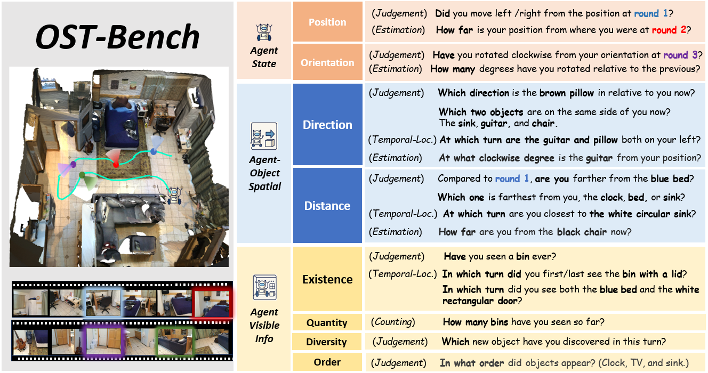

# OST-Bench Data Generation Code

This repository contains the official data generation pipeline for OST-Bench, producing evaluation samples from 3D scene datasets (ScanNet/ARKitScenes/Matterport3D). Features include:
- Automated two-stage sample construction (raw extraction → prompt formatting).
- Unified data outputs compatible with VLMs/LLMs evaluation.

<!--  -->

<div style="text-align: center;">
    
</div>


## 🚀 Getting Started

### Installation


   ```shell
   conda activate your_env_name
   pip install -r requirements.txt
   ```


### Base Data Preparation

Under the `./data` directory:

- Follow the EmbodiedScan [data preparation guidelines](https://github.com/InternRobotics/EmbodiedScan/blob/main/data/README.md) to download base scene data & preprocess 2D scene images (3RScan data is not required).

- Follow the MMScan [data preparation guidelines](https://github.com/InternRobotics/EmbodiedScan/tree/mmscan/data_preparation) to download annotation files & generate post-processed point cloud data.

The final directory structure should be:

```
data/
├── scannet/
│   ├── scans
│   │   ├── <scene_id>
│   │   ├── ...
│   ├── posed_images
├── arkitscenes/
│   ├── Training
│   │   ├── <scene_id>
│   │   ├── ...
│   ├── Validation
│   │   ├── <scene_id>
│   │   ├── ...
├── matterport3d/
│   ├── <scene_id>
│   ├── ...
├── process_pcd/
├── embodiedscan-v2/ embodiedscan_infos_val.pkl
```

*Note* : Note: Since MMScan hasn't released the processing scripts for ARKitScenes point cloud generation, we provide our own. Run the following command to generate processed PCD files for ARKitScenes:
```
python -m tools.arkitscenes_pcd
```

We have provided some pre-processed annotation files under the `./meta_data` directory:

- `arkitscenes.json`/`mp3d.json`/`scannet.json`: Contain textual descriptions of objects from MMScan.
- `route_dict.json`: Stores both automatically generated and manually corrected agent trajectory information for Matterport3D.

## 👓 Samples Construction Pipeline

The OST-Bench sample generation consists of two stages:

- Stage 1: Generate fundamental question samples.

- Stage 2: Incorporate question samples into predefined prompt templates to create final model inputs.

**Execution Commands**

- To run Stage 1 processing:
```
python step1_generation.py --split scannet/arkitscenes/matterport3d
```

- To run Stage 2 processing:
```
python step2_process.py --split scannet/arkitscenes/matterport3d
```
The final generated files will be saved in `./data/step_2`